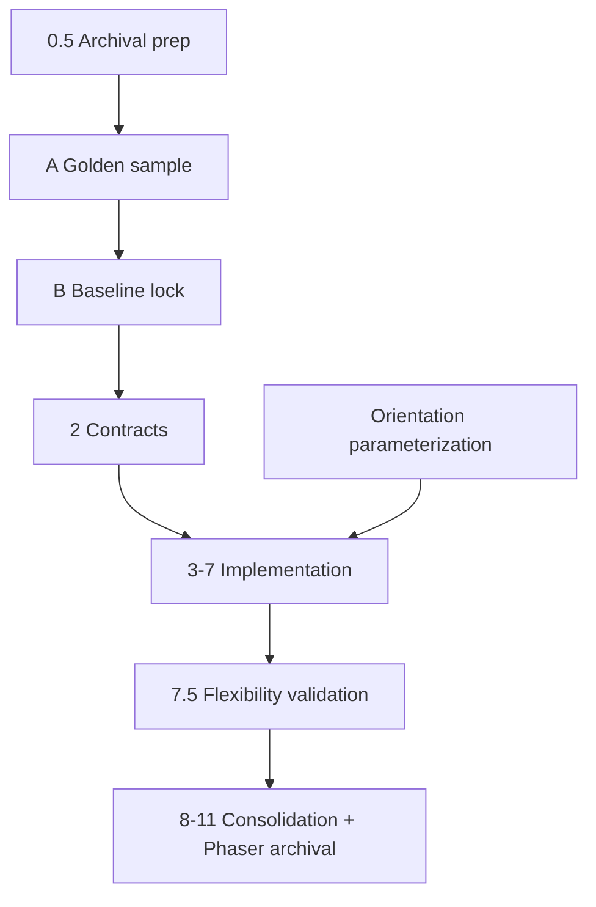

# Cocos + Multi-Agent Refactor Plan

Updated: 2026-07-25
Status: Planning only; informative, not an executable instruction. No source
code, dependency, build, verify, package, test, or CI file changed in this round.
Owner: deterministic Orchestrator (final authority)

## Purpose

This document is the top-level plan for the authorized refactor of the
game-generation Agent:

1. **Engine strategy** — Cocos Creator Web/H5 is the only target engine. Phaser
   is retired: it is no longer a parity or correctness baseline. The current
   stage only prepares Phaser for archival (a migration checklist plus a
   `legacy/` destination). Actual removal from build/verify/package is deferred
   until Cocos independently runs the whole Request → Package pipeline, and is
   unrelated to parity.
2. **Multi-agent orchestration** — split the pipeline into named agents with the
   deterministic Orchestrator as the final authority (see ADR 0030).
3. **Developer fast path** — replace one heavy monolithic gate with layered
   checks (fast / admission / release) that speed iteration without removing any
   safety (see `docs/DEVELOPER_FAST_PATH_PLAN.md`).

A cross-cutting requirement runs through all three: **game orientation must be
parameterized to support both vertical (portrait) and horizontal (landscape)
play. Vertical must never be hardcoded.** The current codebase hardcodes vertical
(see Appendix B), so this is treated as a first-class workstream.

## Correctness standard

Correctness is defined by three things only, and by nothing about Phaser:

- the strict data contracts (spec, design, assembly, graph, manifest);
- the deterministic Verifier (Cocos build + Playwright browser gates);
- a user-accepted Cocos golden sample.

The golden sample anchors the **framework layer and the contract layer only**
(project structure, kernel/adapter split, contract shapes, build/verify rules).
It never anchors the **content layer** (gameplay, counts, pattern mixes, levels,
tuning, art); content is driven freely by GameSpec/GameDesign. Contracts stay
extensible through an **open registry**: new gameplay or bullet patterns are
added by registration, not by editing contract shapes. A forced contract-shape
change is a signal the contract is too tight and must be recorded and relaxed.

## Architecture: six agents + one non-Agent Orchestrator

- **Orchestrator** (`src/orchestration/`): pure TypeScript, calls no LLM, the
  final authority for flow, schema validation, budgets/retry, registry
  resolution, assembly, admission, and packaging. Only it promotes state.
- **Spec Agent**: natural-language request → GameSpec.
- **Design Agent**: GameSpec → GameDesign (orientation and other design
  decisions); data only, no code.
- **Module Agent**: registry selection → ModuleAssembly (admitted modules only).
- **Code Agent** (`src/opencode/`): the only agent that writes code, via OpenCode
  in a deny-by-default sandbox, into whitelisted directories only.
- **Verifier Agent**: deterministic by default (no LLM); Cocos build + Playwright.
- **Repair Agent**: bounded diagnosis only; hands code changes to the Code Agent.

## Global constraints (apply to every round)

- One thin, reversible engine-port or orchestration surface per change.
- Do not delete or weaken existing tests; do not downgrade any schema to make an
  implementation pass. Verification and packaging stay fail-closed.
- Do not rewrite reviewed gameplay factories merely to match a new engine API.
- No download, dependency change, credential read, or paid model call without an
  explicit, separately approved bounded proposal.
- Orientation is a parameter carried by the spec and honored by planners and the
  runtime host. No round may reintroduce a hardcoded vertical assumption.
- Generated specs and modules may never select, install, upgrade, or configure
  the engine.

## Execution rounds (informative sequence)

Rounds are informative material, not executable instructions. Do not auto-advance
past the current task.

### Round 0.5 — Archival preparation (current posture)

- Goal: record the Phaser retirement checklist and the `legacy/` destination for
  retired runtime files, without moving any file or touching build/verify/package.
- Artifact: `docs/PHASER_RETIREMENT_ARCHIVE_PREP.md` (files to archive, protected
  references that would break, coupled tests, and contract-string references that
  must not change).
- Acceptance: documentation only; no `src`, dependency, build, verify, package,
  test, or CI change.

### Round A — Cocos golden sample

- Goal: produce a Cocos golden sample that boots and plays in both orientations
  and obtain explicit user acceptance.
- Acceptance: user accepts the sample as the framework/contract reference. Any
  Cocos toolchain download or dependency change requires separate approval first.

### Round B — Baseline lock

- Goal: freeze the accepted golden sample as the framework + contract baseline
  (project structure, kernel/adapter split, contract shapes, build/verify rules).
- Acceptance: the locked baseline anchors framework/contract only, never content.

### Round 2 — Contracts

- Goal: define the agent and data contracts as strict, open-registry schemas
  derived from the locked baseline.
- Acceptance: contracts parse existing fixtures; new content extends by
  registration without contract-shape edits.

### Rounds 3-7 — Implementation

- Goal: build the Cocos kernel (`src/runtime/kernel/`, engine-neutral) and Cocos
  adapter (`src/runtime/cocos/`, data-driven), the six agents, orientation
  parameterization, and the deterministic Request → Package pipeline.
- Acceptance: vertical and horizontal specs both generate, verify, and package.

### Round 7.5 — Flexibility validation

- Goal: prove the contracts and open registry accept diverse content in both
  orientations without contract-shape edits (anti-ossification check).
- Acceptance: diverse content graphs pass without loosening any contract.

### Rounds 8-11 — Consolidation

- Goal: finish assembly/packaging, then remove Phaser from build/verify/package
  once Cocos runs the full pipeline independently; complete a license/package
  audit and update requirements/architecture/notices.
- Acceptance: Cocos is the only active generated engine; Phaser runtime archived
  under `legacy/`; dependency/license audit clean.

## Sequencing

## Appendix A — Repository structure (starting point)

- `src/orchestration/` — composition + packaging drivers (pipeline flow).
- `src/runs/` — run manifest state machine, artifact hashing, evidence chains.
- `src/requirements/` — NL → `ShooterGameSpec`, completion/playability policies,
  intent ledger, model adapters.
- `src/modules/` — module contract/ABI, registry, resolver, composer, runtime
  catalog, and reviewed gameplay libraries/hosts.
- `src/gameplay/` — pure planners (firing, waves, bullet patterns, scoring).
- `src/runtime/` — shooter composer, runtime game config, resource budgets.
  Engine-neutral kernel (`src/runtime/kernel/`) and Cocos adapter
  (`src/runtime/cocos/`) do not exist yet and are created in rounds 3-7.
- `src/verification/` — Playwright browser verification, gate spec, assertion
  profiles, findings.
- `src/repair/` — bounded repair controller.
- `src/opencode/` — OpenCode SDK compatibility descriptor (Code Agent seam).
- `src/assets/` — license/provenance admission, catalog, selection, grounding.
- `src/evaluation/` — evaluation schemas and probe cases (golden baseline home).
- `game-template/vertical-shooter/` — the retired Phaser H5 template (engine
  seam, scenes, generated runtime), pending archival to `legacy/`.
- `scripts/` — driver scripts (compose, package, browser verify, opencode probe,
  evals, asset acquisition).
- `tests/` — test suite across assets, gameplay, modules, runtime, verification,
  repair, requirements, runs, opencode, docs.

## Appendix B — Retired-Phaser + orientation location inventory

Retired Phaser runtime (confined to `game-template/vertical-shooter/`, pending
archival — see `docs/PHASER_RETIREMENT_ARCHIVE_PREP.md`):

- Engine seam: `.../src/runtime-kernel/phaser-runtime-kernel.ts`.
- Bootstrap + scenes: `.../src/main.ts`, `.../src/scenes/{boot,start,play,end}-scene.ts`,
  `.../src/runtime-assets.ts`.
- Protected wiring that references it: `src/orchestration/run-composition-stage.ts`
  (`RUN_TEMPLATE_SOURCE_FILES`, fixed `vite build`), `src/verification/browser-gate-spec.ts`,
  `src/verification/browser-verification-stage.ts`, `package.json`, and coupled
  tests. These change only in a later, separately authorized round.
- `src/` modules reference Phaser only as emitted contract strings/types, not as
  a running dependency; those strings are not changed by archival.

Orientation — CURRENTLY HARDCODED VERTICAL (must be parameterized):

- No `orientation`/axis field in `ShooterGameSpecSchema` or `RuntimeGameConfig`.
- Player fires up: `src/gameplay/player-firing-planner.ts` (`velocityY: -projectileSpeed`).
- Enemies move down + off-screen cull uses `y > height`:
  `game-template/vertical-shooter/src/scenes/play-scene.ts`.
- Player spawns bottom-center (`height * 0.82`) in `play-scene.ts`.
- Directory/name lock-in: `game-template/vertical-shooter/`.
- Already parameterized (no change needed): bullet-pattern angles in
  `src/gameplay/bullet-pattern-planner.ts`.

## Appendix C — TODOs / open architecture questions (do not act without a round)

- TODO-1: Two ADR directories exist (`docs/decisions/` and `docs/adr/`). Decide
  on consolidation in a later round.
- TODO-2: `RuntimeGameConfig` and `ShooterGameSpec` need an orientation field;
  design its exact shape (enum `vertical|horizontal` vs. an axis vector) before
  editing the schema, without loosening existing viewport bounds.
- TODO-3: The `vertical-shooter` template name encodes orientation; decide whether
  to introduce a neutral Cocos template name or parameterize inside it.
- TODO-4: Confirm whether GameDesign becomes a persisted artifact with its own
  hash in the run manifest, or stays a transient derivation.
